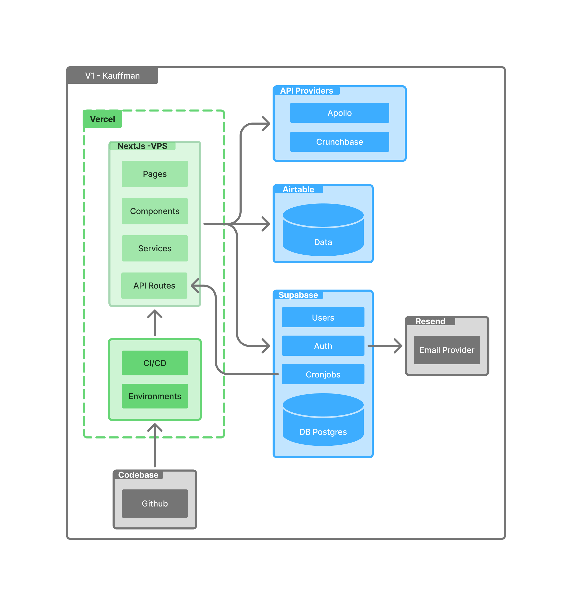

# Tech stack information

Created by: Matias Paradela
Created time: November 14, 2025 10:25 AM
Last edited by: Matias Paradela
Last edited time: December 22, 2025 5:58 PM

# Architecture

## Architecture Summary

- **Frontend/UI:** Next.js 15 + Tailwind CSS + shadcn/ui
- **Content Management:** Airtable (direct integration)
- **Authentication:** Supabase Auth (Magic Links)
- **Email:** Resend
- **Database:** PostgreSQL (Supabase)
- **Data Enrichment:** Apollo? + Crunchbase?
- **Background Jobs:** Supabase Cron Jobs
- **Deployment:** Vercel

# Tech Stack

## Framework & UI

### **Next.js 15**

- React-based framework used to build a **mobile-first web application**.
- Leverages modern App Router features and Server Components.
- Deployed on **Vercel**, ensuring scalability, performance, and SEO benefits.

### **Tailwind CSS**

- Utility-first CSS framework for a clean, responsive, and consistent UI.
- Enables rapid UI development with minimal custom CSS.

### **shadcn/ui**

- Reusable, accessible UI components built on top of Tailwind.
- Ensures design consistency and faster development.

## Content & Data Source

### **Airtable**

- Acts as the **primary data source** and **backoffice (CMS)** for the client.
- Used to manage: Users, Events, Groups, Modules, etc.
- Any new fields added by the client in Airtable are automatically reflected in the web application.
- The web app is mostly **read-only**, focused on listing and displaying data.

### **Airtable JavaScript SDK**

- Official Airtable library used to fetch data directly from Airtable.
- No custom backend or intermediate API layer is introduced for this data.

## Authentication & Email

### **Supabase Auth (Magic Links)**

- Secure, passwordless authentication using magic links.
- Supabase manages: Users, Sessions, Tokens.

### **Resend**

- Email service used by Supabase to deliver magic link emails.
- Provides reliable email delivery and good developer experience.

## Database

### **PostgreSQL (Supabase)**

- Stores **private and enriched user data**, separate from Airtable.
- Used to persist:
    - User configuration
    - Personal data fetched from external APIs
    - Investment-related data

*Airtable is intentionally not used for sensitive or enriched user information.*

## Application Logic

- **Server Components / Server Functions**
    - Used to fetch and render Airtable data.
- **API Routes**
    - Used for internal endpoints, including cron-triggered updates.
- The application contains minimal business logic and focuses mainly on data presentation.

## Data Enrichment & External APIs

### **Apollo?**

- Used to retrieve personal and professional user data from Linkedin.

### **Crunchbase?**

- Used to retrieve investment-related information for users.
- Results from both services are normalized and stored in Supabase PostgreSQL.

## Background Jobs

### **Supabase Cron Jobs**

- Scheduled jobs trigger HTTP requests to a dedicated Next.js API endpoint.
- The endpoint:
    1. Iterates over users
    2. Calls Apollo and Crunchbase APIs
    3. Updates user data in Supabase PostgreSQL

This ensures automated and periodic data updates.

## External Links & Integrations

- **Event registration:** Redirects to external platforms via links.
- **WhatsApp groups:** Users join via external invitation links.

*No internal handling of registrations or group memberships is required.*

## Version Control & Deployments (CI/CD)

- **GitHub** is used as the single source of truth.
- Automatic deployments:
    - `production` and `staging` are deployed on **Vercel**.
    - `develop` are deployed on **Coolify**